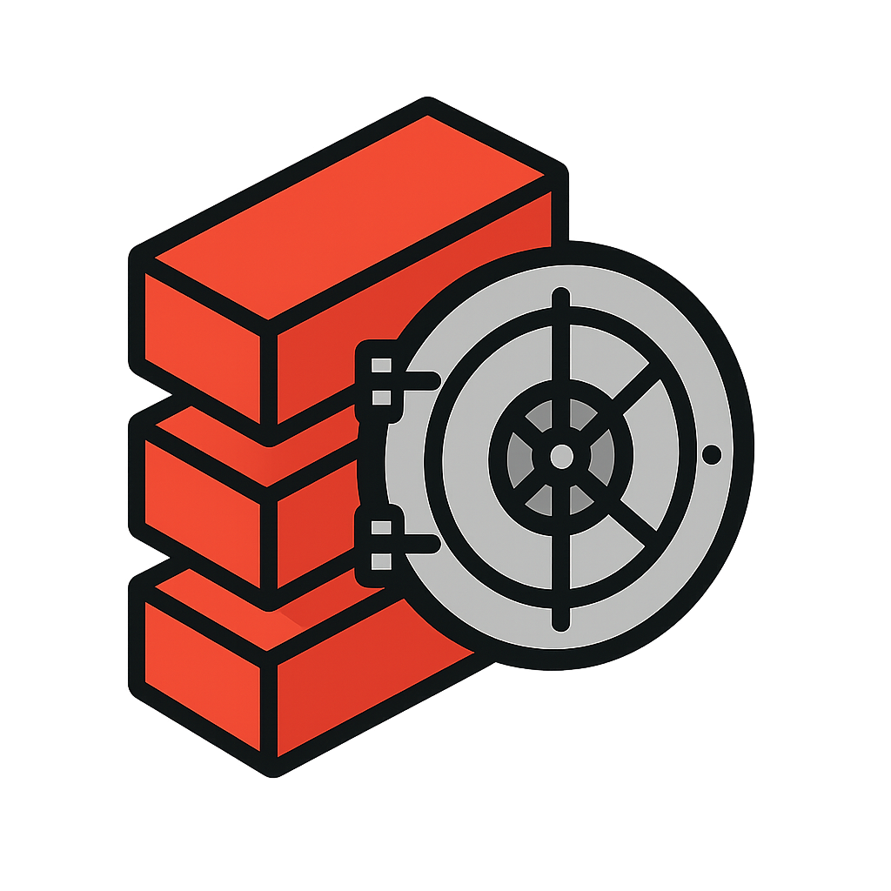

# Vaultabricks

<div align="center">
  
  <br/>
  <p><i>A modern web interface for managing Databricks Secrets</i></p>
</div>

## Overview

Vaultabricks is a web-based interface for managing Databricks Secrets and Access Control Lists (ACLs). It provides a user-friendly way to create, update, and delete secrets and their associated permissions.

## Quick Start

### Using Docker

```bash
# Pull the latest image
docker pull ghcr.io/your-username/vaultabricks:latest

# Run the container
docker run -p 5000:5000 ghcr.io/your-username/vaultabricks:latest
```

The application will be available at `http://localhost:5000`

### Local Development

1. Clone the repository:
```bash
git clone https://github.com/your-username/vaultabricks.git
cd vaultabricks
```

2. Install dependencies:
```bash
pip install -r requirements.txt
```

3. Run the application:
```bash
uvicorn main:app --reload
```

## Usage

1. Enter your Databricks workspace URL (e.g., `https://your-workspace.cloud.databricks.com`)
2. Provide your Personal Access Token (PAT)
3. Start managing your secrets and ACLs

## Development

### Prerequisites

- Python 3.11+
- Docker (optional)

### Building Docker Image

```bash
docker build -t vaultabricks .
```

## Contributing

1. Fork the repository
2. Create your feature branch (`git checkout -b feature/amazing-feature`)
3. Commit your changes (`git commit -m 'Add some amazing feature'`)
4. Push to the branch (`git push origin feature/amazing-feature`)
5. Open a Pull Request

## License

This project is licensed under the MIT License - see the [LICENSE](LICENSE) file for details.

## Authors

* **[flavsdotpy](github.com/flavsdotpy)**
