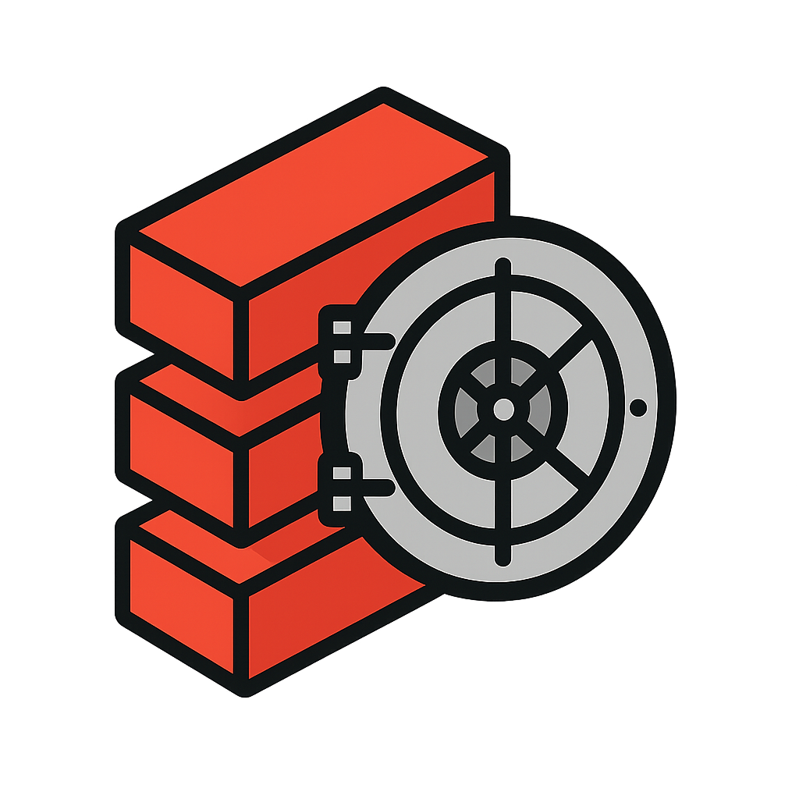

# Vaultabricks

<div align="center">
  
  <br/>
  <p><i>A modern web interface for managing Databricks Secrets</i></p>
</div>

## Overview

Vaultabricks is a web-based interface for managing Databricks Secrets and Access Control Lists (ACLs). It provides a user-friendly way to create, update, and delete secrets and their associated permissions.

## Authentication Modes

Vaultabricks supports two authentication modes:

1. Databricks App mode: When the app detects the Databricks App runtime through the default `DATABRICKS_APP_NAME` and `DATABRICKS_HOST` environment variables, it automatically uses Databricks SDK unified authentication from the app runtime. Users do not need to enter a workspace host or PAT in the UI.
2. Manual mode: Outside Databricks Apps, Vaultabricks keeps the existing behavior and prompts for a workspace host and Personal Access Token (PAT).

## Quick Start

### Using Docker

```bash
# Pull the latest image
docker pull ghcr.io/flavsdotpy/vaultabricks:latest

# Run the container
docker run -p 5050:5050 ghcr.io/flavsdotpy/vaultabricks:latest
```

The application will be available at `http://localhost:5050`

### Local Development

1. Clone the repository:
```bash
git clone https://github.com/flavsdotpy/vaultabricks.git
cd vaultabricks
```

2. Install dependencies:
```bash
# Install Poetry if you haven't already
curl -sSL https://install.python-poetry.org | python3 -

# Install project dependencies
poetry install
```

3. Run the application:
```bash
poetry run uvicorn main:app --reload --port 5050
```

4. Open the app and provide your Databricks workspace URL and PAT.

### Databricks Apps Deployment

When deployed as a Databricks App, Vaultabricks automatically detects the app runtime and uses the runtime-provided Databricks authentication context. No manual Databricks credential entry is required in the UI.

## Usage

1. Local/manual mode: Enter your Databricks workspace URL and PAT, then start managing scopes, secrets, and ACLs.
2. Databricks App mode: Open the app and start managing scopes, secrets, and ACLs immediately with the app's inferred Databricks authentication.

## Development

### Prerequisites

- Python 3.11+
- Poetry
- Docker (optional)

### Building Docker Image

```bash
docker build -t vaultabricks .
```

## Contributing

1. Fork the repository
2. Create your feature branch (`git checkout -b feature/amazing-feature`)
3. Commit your changes (`git commit -m 'Add some amazing feature'`)
4. Push to the branch (`git push origin feature/amazing-feature`)
5. Open a Pull Request

## License

This project is licensed under the MIT License - see the [LICENSE](LICENSE) file for details.

## Authors

* **[flavsdotpy](github.com/flavsdotpy)**
